# File actions

##  Project Dashboard

Show different statistic about the current project location

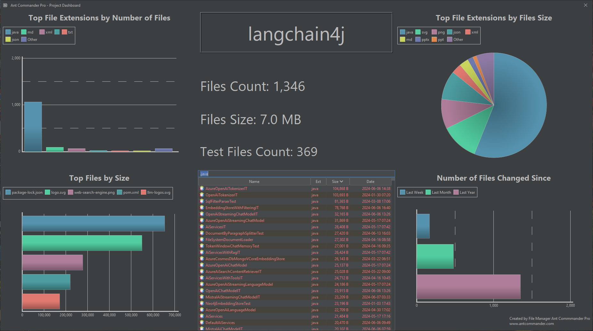

##  Rename File

Rename selected file

Shortcut: <kbd>Ctrl</kbd> + <kbd>F2</kbd> (<kbd>⌘</kbd> + <kbd>F2</kbd>)

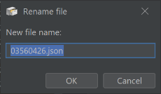

##  New File From Clipboard

Create a new file and put the content of the clipboard in the file

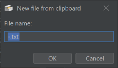

##  Show File Size Graph

Show files and directories sizes in a chart

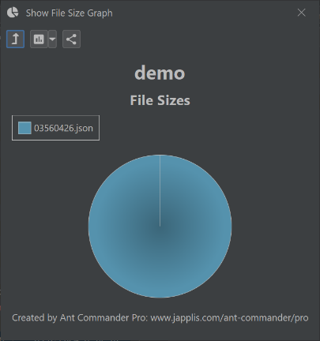

##  New Directory

Create a new directory and navigate to this new directory. If some files are selected, it offers the option to move the files to this new directory.

Shortcut: <kbd>F7</kbd>

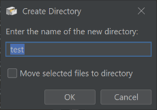

##  Move Files with flatten directory structure

Move selected files and files in selected sub-directories to another directory. The directory structure is not copied.

##  Split files

Split the content selected file in multiple files

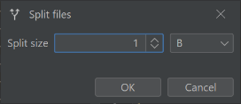

##  Change Date/Time

Change the last modified date/time of selected files and directories to the specified date/time

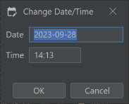

##  Copy and Rename Files

Copy and rename selected files at the same time

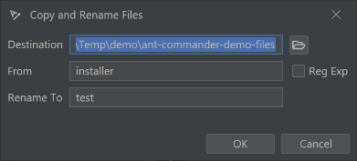

##  Copy Names with Options

Copy the name of the selected files and directories based on the selected options

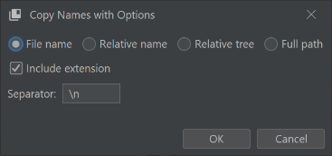

##  Empty file content

Empty the content of the selected files

##  Store directory files in text (.lst)

Create a .lst file containing the list of the files and (sub-)directories of the current location. This .lst file then can be opened using the lst file system.

##  New File

Create a new file

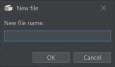

##  Monitor For Changes

Monitor selected files and directories. Get notified when a file or directory is changed.

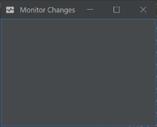

##  Show File Stats/Checksums

Show different information about the selected files and directories

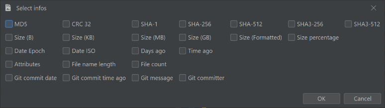

##  Unpack in directory

Uncompress the selected files to the directory the files are in

##  Execute

Execute selected files

##  Create Checksums Files

Check if any of the selected files matches the checksum currently in the clipboard

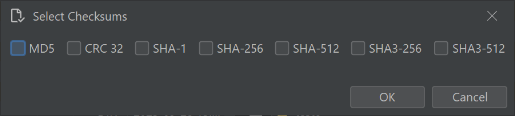

##  Copy Paths in Clipboard

Copy the full path of the selected files and directories to the clipboard

##  Replace in Files

Find and replace some text in selected (text) files. Note that it will use UTF-8 encoding.

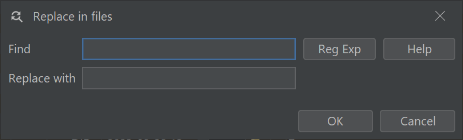

##  Create Multiple Directories

Create multiple directories and sub-directories

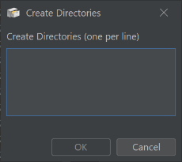

##  Start Shell

Open a terminal in the currently used directory

##  Copy to missing cluster locations

For the cluster file system, if a file is missing in some directories, the last modified file will be duplicated to the missing directories.

##  Copy Files

Copy selected files and directories

Shortcut: <kbd>F5</kbd>

##  Copy Content

Copy the content of the selected file to the clipboard. If more than one file is selected the content of the files is appended.

##  Rename multiple files

Rename selected files. Click on the help button of the rename form for more help.

For more details see [Help rename multiple files](rename-multiple-files.md)

Shortcut: <kbd>Ctrl</kbd> + <kbd>R</kbd> (<kbd>⌘</kbd> + <kbd>R</kbd>)

##  Open in OS File Manager

Open the operating system file manager at the currently used location

##  Change file time to creation time

Change the last modified time of selected files to the creating time of the file if available for the file system

##  Unify file times

Put the same last modified time of selected files

##  Copy to multiple directories

Copy selected files and directories to multiple directories

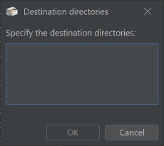

##  Duplicate file(s)

Duplicates selected files

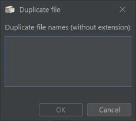

##  Move Files

Move selected files and directories

Shortcut: <kbd>F6</kbd>

##  Delete permanently

Permanently delete selected files and directories

Shortcut: <kbd>Shift</kbd> + <kbd>DELETE</kbd> (<kbd>⇧</kbd> + <kbd>DELETE</kbd>)

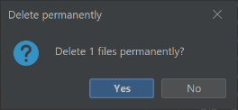

##  Rename extension

Rename the extension of the selected files

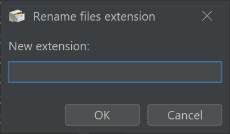

##  Touch file(s)

Change the last modified date/time of selected files and directories to now

##  Copy Files with flatten directory structure

Copy selected files and files in selected sub-directories to another directory. The directory structure is not copied.

##  Delete

Move selected files and directories to the recycle bin

Shortcut: <kbd>DELETE</kbd>

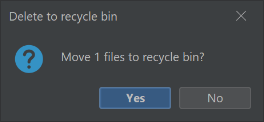

##  Verify checksum

Check if any of the selected files matches the checksum currently in the clipboard

##  Copy Last Modified Date/Time

Similar to copy overwrite file, except it copies only the last modified timestamp

##  Unpack / Unzip

Uncompress the selected files to a directory

##  Diff directories...

Show a window that help you find the difference between 2 directories

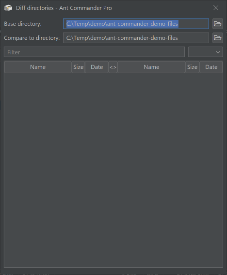

##  Special rename multiple files

Rename selected files based on special files criteria.

Note that the extension is not included in the rename.

* Rename files by truncating the file name to the first 'x' characters
* Change the case of the files
* Append a number to the filenames
* Convert accents and diacritics in filename to ascii (so removing the accent of diacritic of the letter)
* Rename using the provided file mapping.

For more details see [Help rename multiple files](rename-multiple-files.md)

##  New Files

Create multiple new files

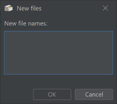

##  Show properties

Show file properties for Windows local files

##  Match Lst with Directory

Match a .lst file system with an existing directory

##  Open

Execute selected files

##  New File(s) From Template

Create a new file based on a template. Templates are located in the 'templates' directory of the application or of the data directory

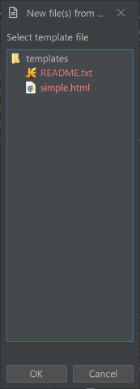

##  Categorize files

Move selected files to created sub-directories based on file last modified date or file name

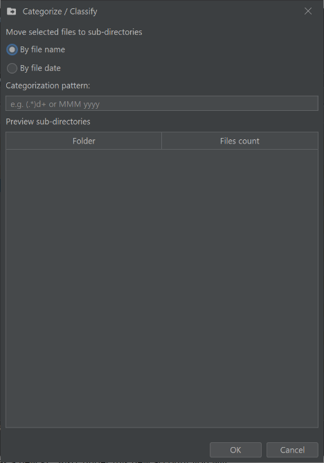

Examples for file name:
* _.*\.(.*)_ classifies the selected files in sub-directories based on file extension
* _([^-]+)_ classifies the selected files in sub-directories based on text that is defined before the first hyphen in the file name
* _(\d+).*\._ classifies the selected files in sub-directories based on the first number that is specified in the file name (before the extension)

More about regular expression [here](https://docs.oracle.com/en/java/javase/17/docs/api/index.html)

Examples for file date:
- _MMM_ classifies the selected files by short months (Jan, Feb, Mar, ...)
- _'Invoice-'MMMM-YYYY_ classifies the selected files by month and year with 'Invoice-' as prefix (Invoice-January-2024, Invoice-February-2023, ...)

More about date pattern [here](https://docs.oracle.com/en/java/javase/17/docs/api/java.base/java/time/format/DateTimeFormatter.html)
 

##  Copy Names in Clipboard

Copy the names of the selected files and directories to the clipboard

##  Compress / Zip

Compress the selected files and directories to a zip file

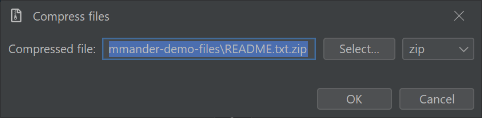

##  Execute with...

For Windows, open the selected files with another software than the default one

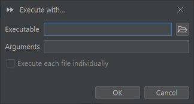

##  Combine files

Combine the content of the selected files in one file

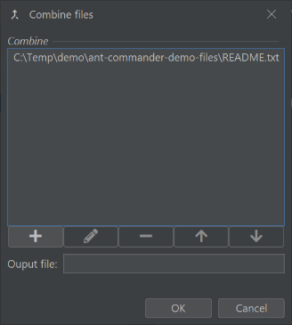

##  Git add

Execute a Git add command for selected files

##  Git ignore

Add the selected files to Git ignore

##  View in GitHub

For github file system, go to the GitHub website of the current location

## Share Directory

This opens a FTP server user interface, you can add users to share the current directory (and sub directories).

You can specify if read-only and filter which kind of file to offer.

Compared to another FTP server that shares local files, Ant Commander Pro FTP Server can share any file of the supported file systems.
