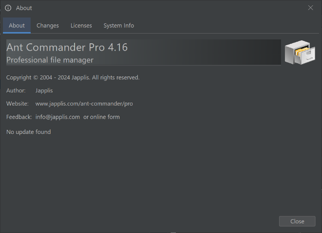
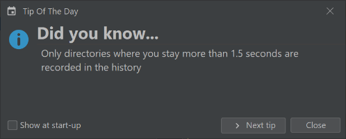
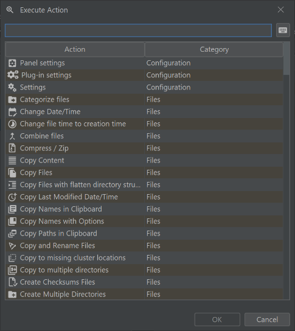

# Generic action

##  About

Show the about window of this application. The about window includes the version of the application, the change logs, the license of the application and of the libraries used as well as technical information about the application, including the logs that may contain more information about errors.

##  Send logs

In connection settings, action to send the application logs to a server for example to report an error

##  Copy Path in Clipboard

Copy the location of the currently selected panel to the clipboard

Shortcut: <kbd>Ctrl</kbd> + <kbd>L</kbd> (<kbd>⌘</kbd> + <kbd>L</kbd>)

##  Show Tip of the Day

Show a tip each day the application is started

##  Execute Action

Open a window that list all the currently enabled action with a text field to quickly find the wanted action. Click on the keyboard button to show the shortcuts if the actions.Hitting enter in the text field will execute the first action of the table.

Shortcut: <kbd>F9</kbd>

##  Website

Go to the website of the application

##  Help

Open the help for this application in a browser

Shortcut: <kbd>F1</kbd>

