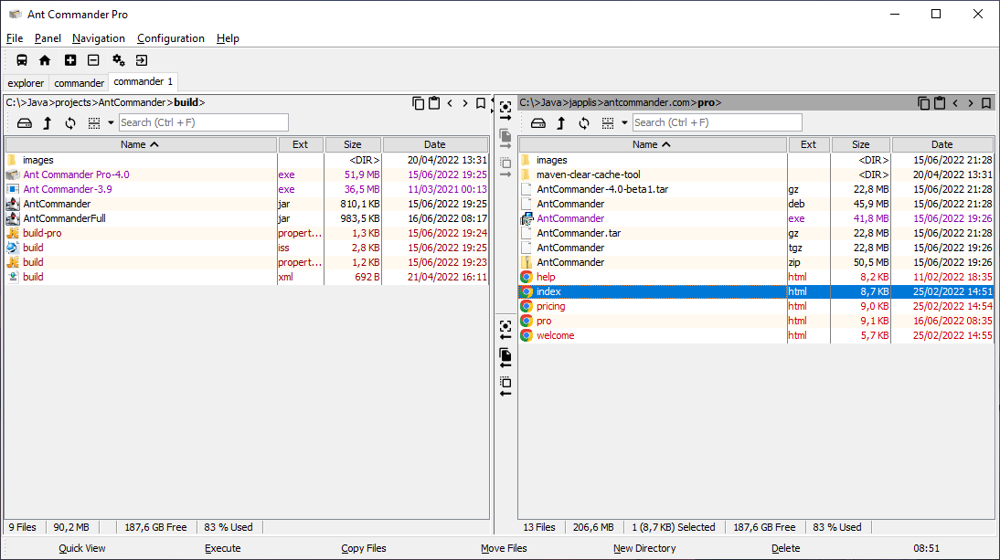

## Ant Commander Pro File Manager - Help

[Ant Commander](https://www.antcommander.com) is a file manager for Windows, macOS and Linux.
There are 2 versions of the file manager
- Ant Commander Personal edition is a free file manager and targeted at a personal usage
- Ant Commander Pro is a commercial file manager and targeted at a professional usage

This help focusses on Ant Commander Pro. Ant Commander Personal is a subset of Ant Commander Pro. 
See [Ant Commander website](https://www.antcommander.com/pricing.html) for the difference between the versions.

### Principles

#### Panels
[Panels](panels.md) are used to mostly view files and directories. You can have multiple panels per tab or open one in a new window.

| Directories     | Files            | Shell            | Other         |
|-----------------|------------------|------------------|---------------|
| Directory table | Text Editor Pro  | Command Line Pro | Tree Map Grid |
| Directory tree  | Image Viewer Pro | Powershell       | Applet Runner |
| Thumbnails      | Binary Editor    | Git bash/Cygwin  | Bookmark      |
|                 | HTML Viewer      | WSL2             | Mega Toolbar  |
|                 |                  | SSH              |               |
|                 |                  | Bean Shell       |               |

#### File systems

[File systems](file-systems.md) are used to browse directories and view files.

| Local                   | Compressed     | Network   | Other           |
|-------------------------|----------------|-----------|-----------------|
| Local disks             | zip/jar        | ftp       | Lst (Text file) |
| USB Sticks              | tar            | sftp/ftps | GitHub          |
| Mounted network drives  | gzip/bzip2     | WebDAV    | Cluster         |
| Shared drives/UNC Paths | Z, xz          | http(s)   | Bookmark        |
|                         | LZ4            | S3        | RAM             |
|                         |                | Smb, smb2 |                 |
|                         |                | NFS3      |                 |

#### Actions
[Actions](actions.md) are actions that you can perform in the application.

Many actions are available in the menu bar of the application. The main actions are available in the toolbar and status bar of the application and of the panel.

Example of actions: Go to a directory, Copy Files, Show Settings.

Some actions can be disable if the action is not available for the currently selected panel, currently used file system or directory.
The enabled actions are listed in the _File -> Execute action_ (<kbd>F9</kbd>) action.

#### Shortcuts
Shorcuts are keyboard key combinations that execute an action.
For example ```F7``` key will open the create directory window.

See the [list of Ant Commander Pro shortcuts](shortcuts.md)

#### Settings

You can also change the [configuration of Ant Commander Pro](settings.md) to fit your preference.



