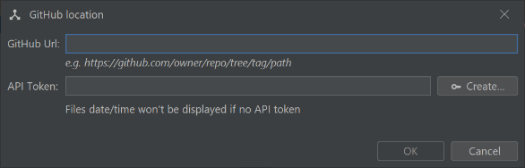
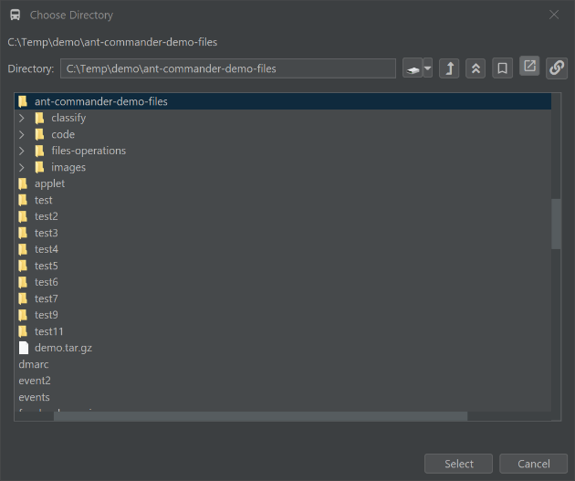
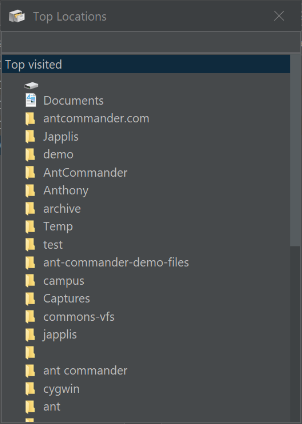
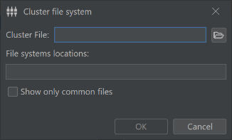
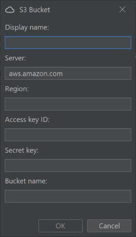
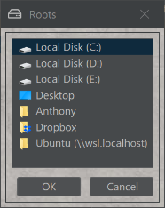
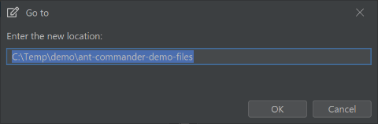

# Navigation actions

##  Go to GitHub

For the github file system, go to the GitHub website of the current directory

##  Go To...

Open a window to select a new location for the current panel

Shortcut: <kbd>Ctrl</kbd> + <kbd>G</kbd> (macOS: <kbd>⌘ Command</kbd> + <kbd>G</kbd>)

##  Show files from all cluster

Open a cluster file in a cluster file system

##  Go to Link

Go to the location that the link is pointing to

##  Super Bookmark 1

Go to the location of the super bookmark n°1

Shortcut: <kbd>Ctrl</kbd> + <kbd>1</kbd> (macOS: <kbd>⌘ Command</kbd> + <kbd>1</kbd>)

##  Super Bookmark 2

Go to the location of the super bookmark n°2

Shortcut: <kbd>Ctrl</kbd> + <kbd>2</kbd> (macOS: <kbd>⌘ Command</kbd> + <kbd>2</kbd>)

##  Super Bookmark 3

Go to the location of the super bookmark n°3

Shortcut: <kbd>Ctrl</kbd> + <kbd>3</kbd> (macOS: <kbd>⌘ Command</kbd> + <kbd>3</kbd>)

##  Forward

Go to the next file or directory from the history

##  Reload

Reload the current location

##  Open file as zip file

Open the selected file as a directory by considering that it's a zip file

##  Show Top Used Locations

Show a window with the top visited locations

##  Lazy Reload

Reload the file or directory without updating the current panel if the file or directory hasn't changed

##  Other Panel

Navigate to the same location than the panel next to it

##  Home

Go to the user home directory

##  Up

Go to the parent directory of the current location

Shortcut: <kbd>Alt</kbd> + <kbd>UP</kbd> (macOS: <kbd>⌥ Option</kbd> + <kbd>UP</kbd>)

##  Add Bookmark

Add the current location to the bookmarks of the panel type

##  Go to Cluster

Create/Open a cluster file system

##  Go to S3

Open a S3 file system

##  Next

Open the next file in the same directory

##  Add Bookmark

Add a bookmark

Shortcut: <kbd>Ctrl</kbd> + <kbd>B</kbd> (macOS: <kbd>⌘ Command</kbd> + <kbd>B</kbd>)

##  Bookmarks

List the bookmark of the panel type

##  Choose Disk

Show the possible local file roots to navigate to

##  Go To Selected File

Go to the selected file

##  Open local file

Open a local file chooser

##  Go To Clipboard Content

Go to the location that is in the clipboard

##  Change Location

Change the panel location of the target panel to match the source panel

##  Go to text field

Open a window that allows you to enter the url of the location you want to go to

##  Back

Go to the previous file or directory from the history

##  Root

Go to the root location to the current file system

##  Previous

Open the previous file in the same directory

##  Close connection

Close the network connection for network file systems

##  Bookmarks

List the bookmark of the panel type in a pop-up menu

##  Go to Matching

If a file system can have a matching file (like .lst), go to the matching file

##  Bookmarks

List the application bookmarks

