

##  Rename Tab

Rename the current tab

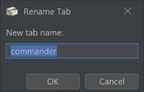

##  Replace Panel

Replace the currently selected panel with a panel of another type

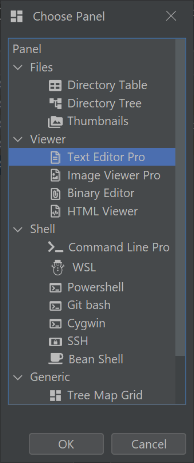

##  Screenshot panel to clipboard

Copy the inside of the current panel as an image to the clipboard. If there is a scroll bar, the entire content is in the image

##  Link selection to next panel

Link the selected of a panel to another one that show the selected one

##  Screenshot selected panel to clipboard

Copy the current panel as the image to the clipboard including toolbar and status bar

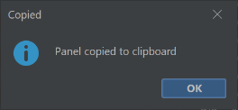

##  Show Top Used Files

Show a window with a list of the top opened files

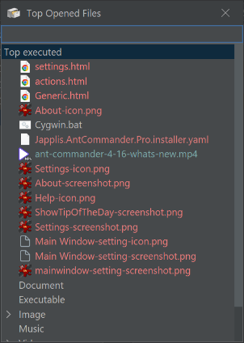

##  Show search help

Show the help page of the search field

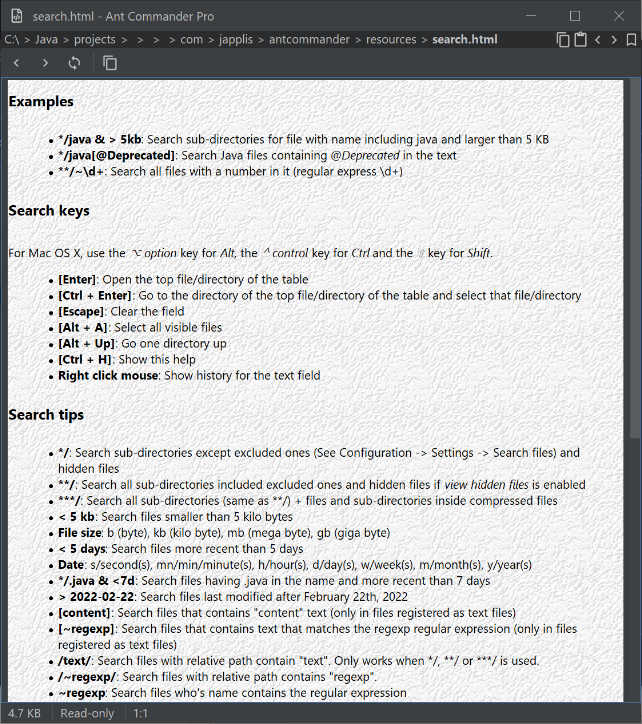

##  Shift Tab Right

Move the current tab to 1 slot right (if possible)

##  Quick View

Open a new window with a view panel of the selected file

Shortcut: <kbd>F3</kbd>

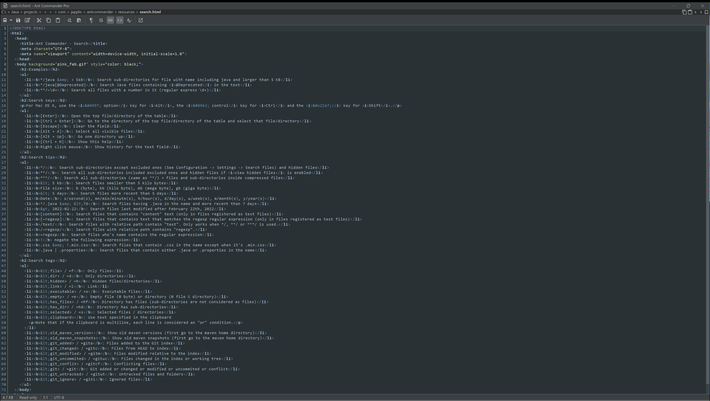

##  Shift Tab Left

Move the current tab to 1 slot left (if possible)

##  Unlink selection from next panel

Unlink previously linked panel

##  Remove Tab

Remove the current tab

##  Parent in Panel

Replace the currently selected view file panel with a directory table of the parent directory

Shortcut: <kbd>Shift</kbd> + <kbd>Alt</kbd> + <kbd>UP</kbd> (macOS: <kbd>⇧ Shift</kbd> + <kbd>⌥ Option</kbd> + <kbd>UP</kbd>)

##  Remove Panel

Remove the currently selected panel

Shortcut: <kbd>Ctrl</kbd> + <kbd>W</kbd> (macOS: <kbd>⌘ Command</kbd> + <kbd>W</kbd>)

##  Show clipboard

Open a view file panel with the content of the clipboard

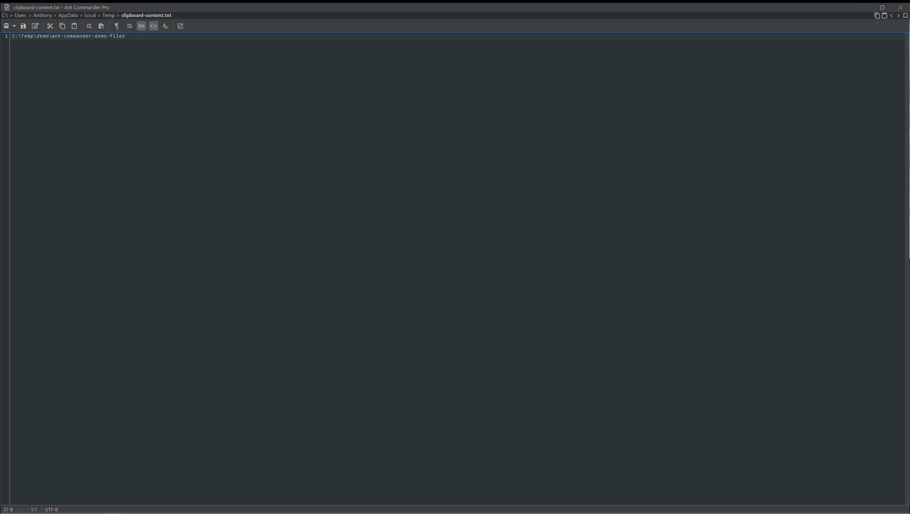

##  Preview in Panel

Replace the currently selected panel with a view panel of the selected file

Shortcut: <kbd>Shift</kbd> + <kbd>F3</kbd> (macOS: <kbd>⇧ Shift</kbd> + <kbd>F3</kbd>)

##  Manage panels

Manage the panels in the main window

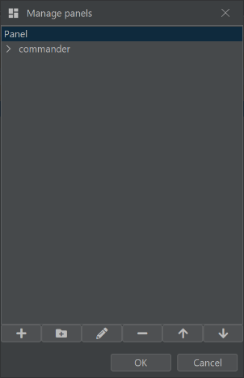

##  Add tab from presets

Add a new tab with the defined panels and parameters

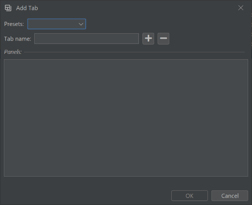

##  Open in Split

Open a new view panel of the selected file in a new split

##  Screenshot view in panel to clipboard

Copy the visible part of the main component of the panel as image to the clipboard

##  Clone Tab

Clone the current tab in a new tab

##  Open in Tab

Open a new tab with a view panel of the selected file

##  Add Panel

Add a new panel. Show a window

Shortcut: <kbd>Ctrl</kbd> + <kbd>N</kbd> (macOS: <kbd>⌘ Command</kbd> + <kbd>N</kbd>)

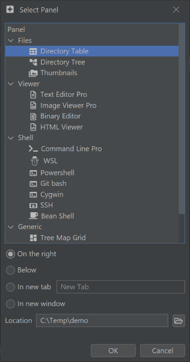

##  Execute command

Execute a command line in a new shell window

Shortcut: <kbd>Shift</kbd> + <kbd>Ctrl</kbd> + <kbd>F9</kbd> (macOS: <kbd>⇧ Shift</kbd> + <kbd>⌘ Command</kbd> + <kbd>F9</kbd>)

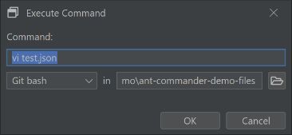

##  Clone Panel

Clone the currently selected panel

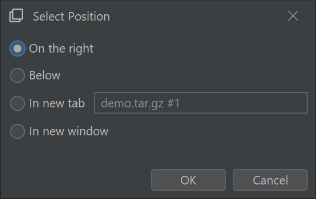

