# Panels

## Directory Panels

### Directory table

The directory table panel will list files in a table.

* _Click_ on the header to sort by name, extension, size or date.
* Click again to sort in reverse order (or _ctrl + click_ to directly sort in reverse order)
* _Double click_ to open a directory or file
* Or use _alt + single click_ to open a directory or file
* Use _ctrl + F_ to access the search field
* Once in the search field, use _ctrl + H_ to access the help section for the search

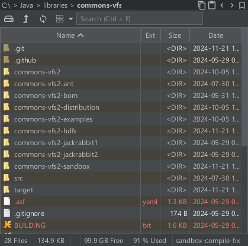

Here are the settings for the directory table panel

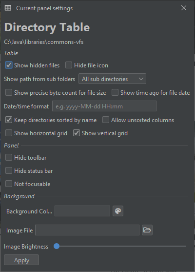

### Directory tree

The directory tree panel will list sub-directories in a tree.

Most of the time it will be linked to a directory table to show the files of the selected branch of the tree.

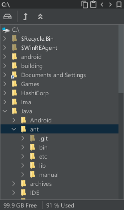

Here are the settings for the directory tree panel

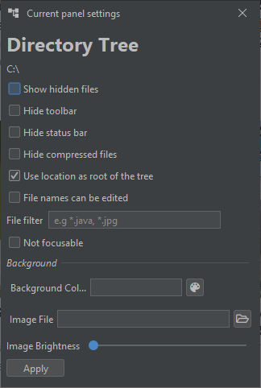

### Thumbnails

The thumbnails panel will show the images inside a directory as thumbnails.

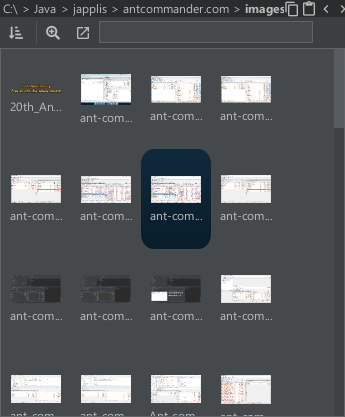

Here are the settings for the thumbnails panel

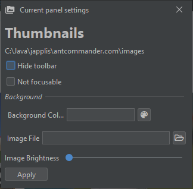

## File Viewers

### Text Editor Pro

The Text Editor Pro panel is a text file viewer and editor.

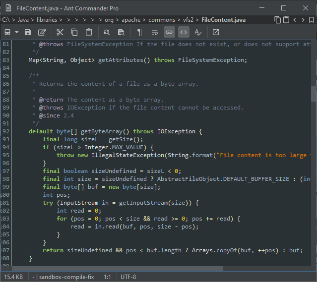

Here are the settings for the text editor pro panel

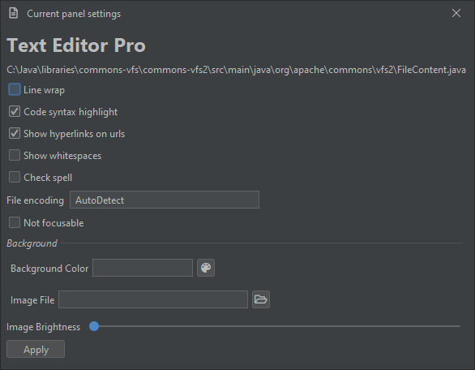

### Image Viewer Pro

The Image Viewer Pro panel is an image viewer.

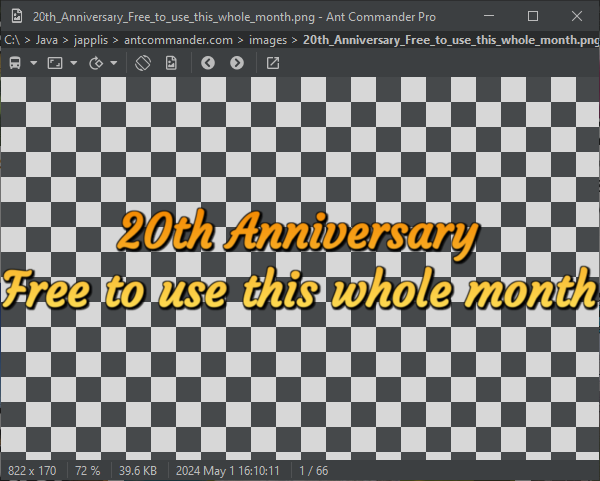

Here are the settings for the image viewer panel

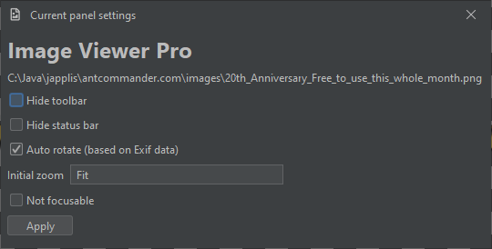

### Binary Editor

The Binary Editor panel allows to view content of files when they are not text files. 
I would advice to not edit the file unless you are sure of what you're doing.

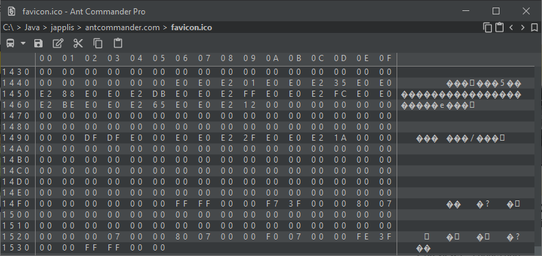

### HTML Viewer

The HTML Viewer panel is a panel to view basic HTML (3.2) content.
I would advice againts using it to view real website. It doesn't interpret CSS or JavaScript. 
This panel is used for example to show help sections.

## Shells

### Command Line Pro

The Command Line Pro panel opens the default shell of your operating system.

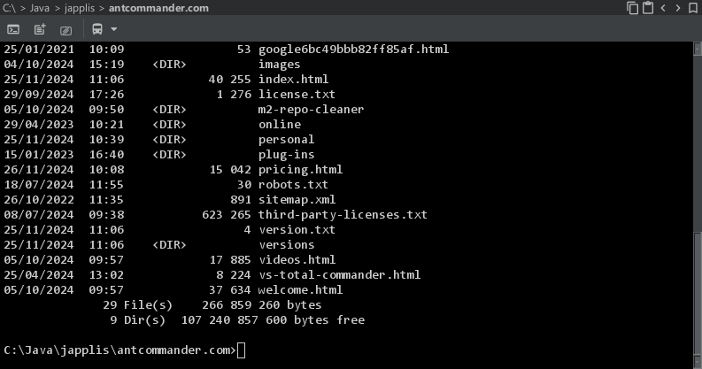

Here are the settings for the command line pro panel

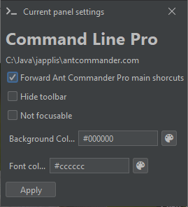

### Powershell

You have the possibility to open Powershell instead of the default command line using this panel.

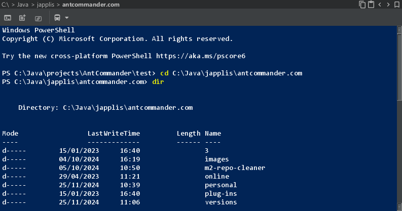

### Git bash / Cygwin

For Windows users, you have Cygwin or Git bash in your PATH environment variable, you will have the option to use it in a panel.

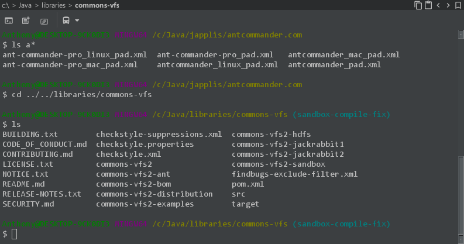

### WSL2

For Windows users, if you have Windows Subsytem for Linux 2 install, you will have the option to use it in a panel.

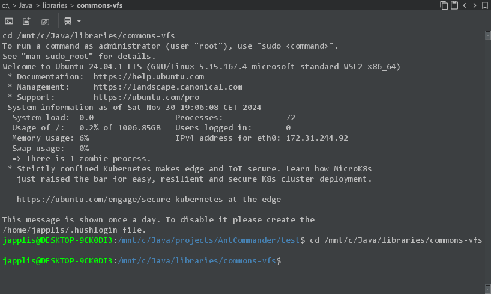

### SSH

If you want to connect to a remote server, you have the option to have SSH in a panel.

[//]: # (### Bean Shell)
[//]: # (Bean Shell is a shell that allows to write and execute code. The language is similar to Java. See [Bean shell website](https://github.com/beanshell/beanshell) for more info.)
[//]: # (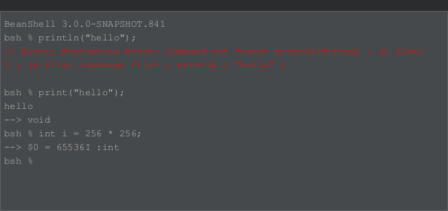)

## Other

### Tree Map Grid

Tree Map Grid panel will show files and directories inside a directory in a grid. The size of each cell is proportianal to the size of the file or directory.
Sub-directories are buttons that can be clicked on to navigate to this sub-directory.

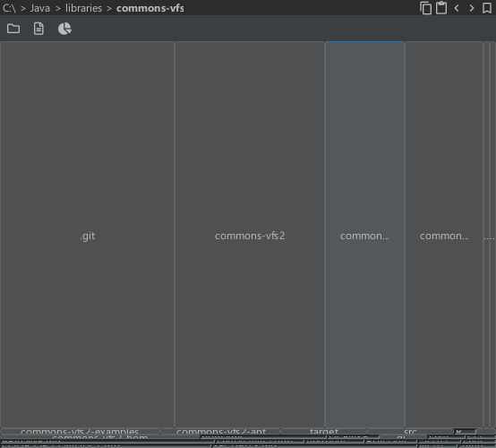

### Applet Runner

Applet Runner panel allows to run Java applets inside a panel. It includes more than 100 applets in the bookmarks.

See [Applet Runner website](https://www.japplis.com/applet-runner/) for more info.

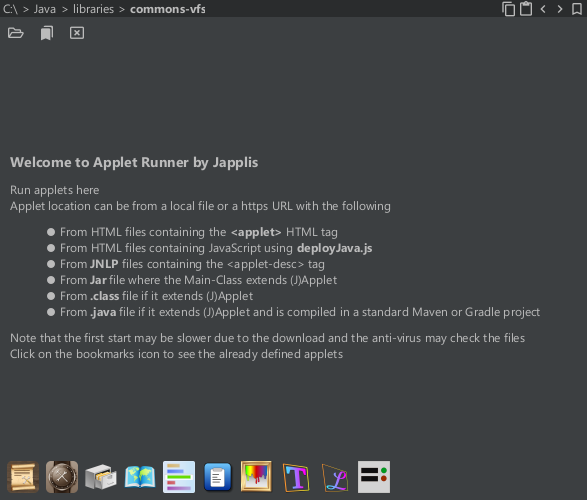

Here are the settings for the Applet Runner panel
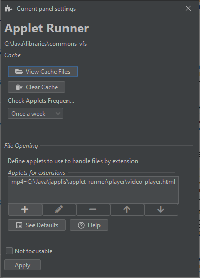

### Bookmark

Bookmark panel shows your bookmarks in a panel. Note that will panel will probably be replaced by the bookmark file system.

### Mega Toolbar

Mega toolbar panel will show buttons for different actions in a panel.
