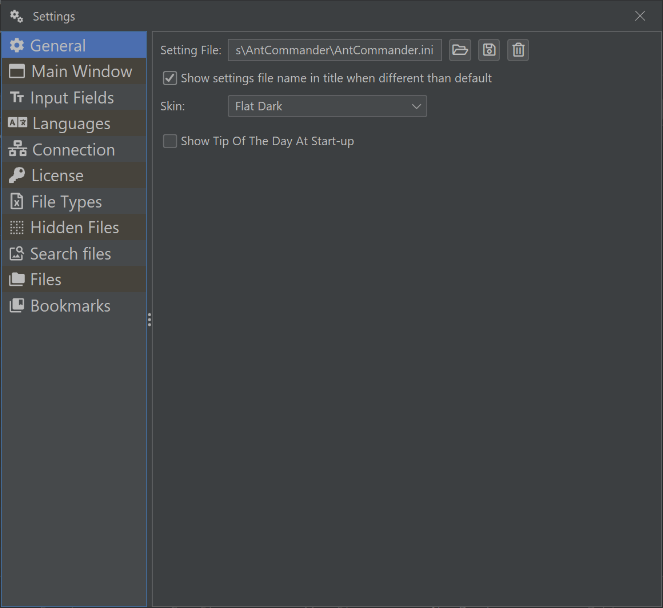
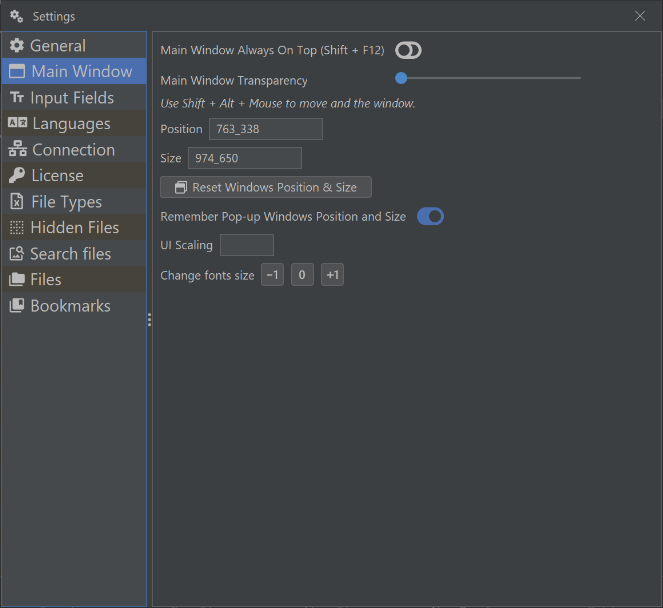
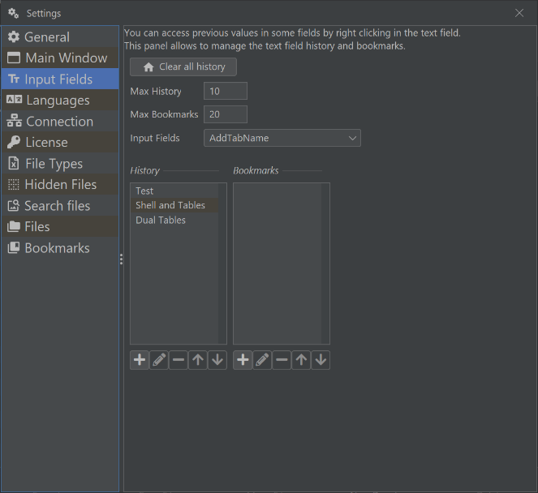
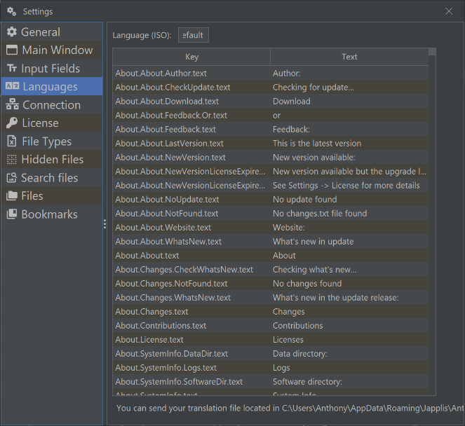
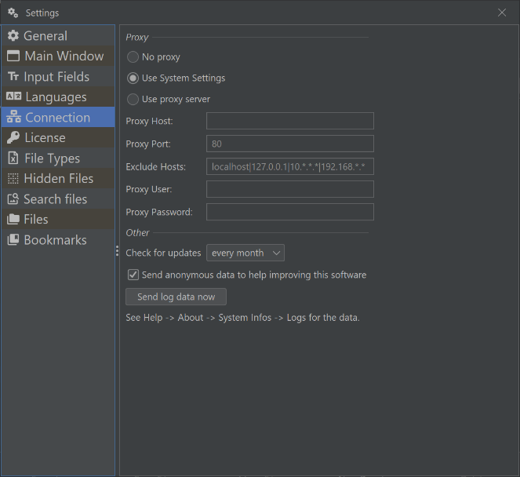
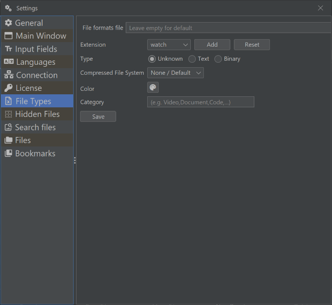
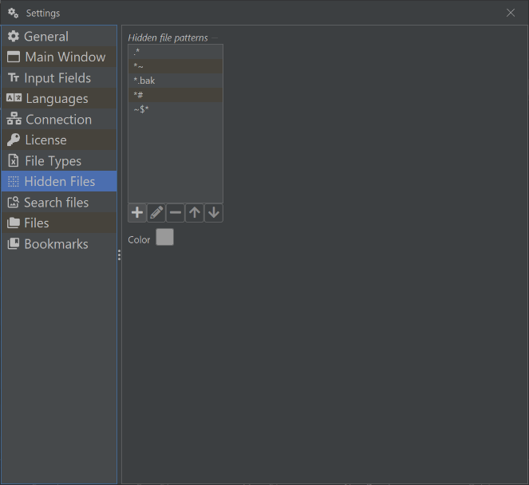
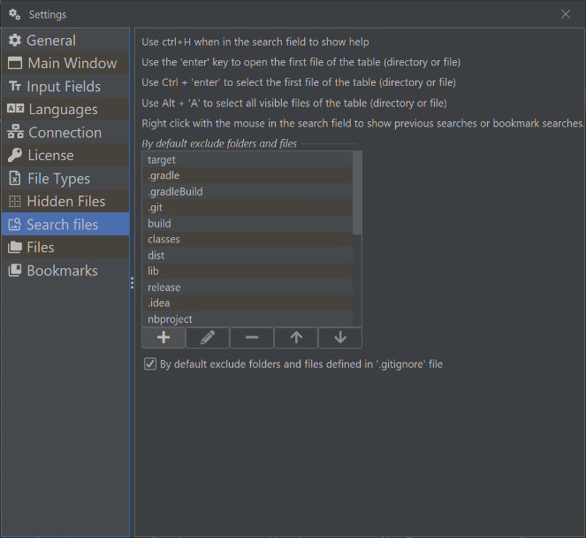
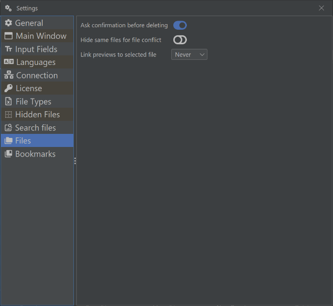
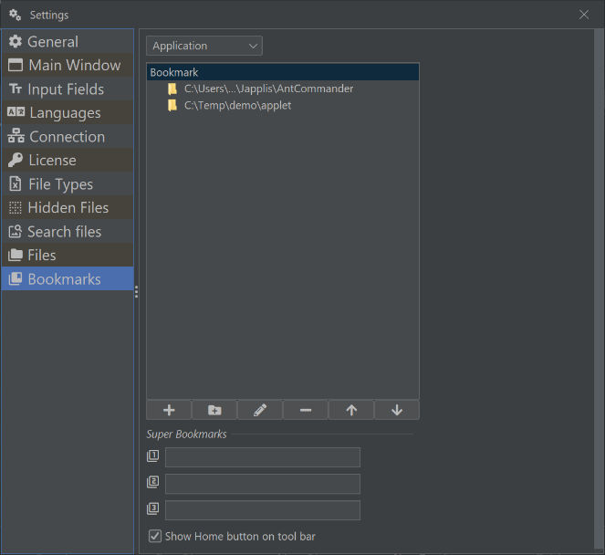

# Settings
*  [General](#general)
*  [Main Window](#mainwindow)
*  [Input Fields](#inputfields)
*  [Languages](#languages)
*  [Connection](#connection)
*  [License](#license)
*  [File Types](#filetypes)
*  [Hidden Files](#hiddenfiles)
*  [Search files](#searchfiles)
*  [Files](#files)
*  [Bookmarks](#bookmarks)

For panels settins, see [panels](panel-types.md)

##  General

##  Main Window

##  Input Fields

##  Languages

##  Connection

##  License

##  File Types

##  Hidden Files

##  Search files

##  Files

##  Bookmarks

