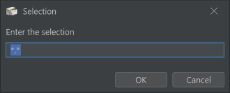
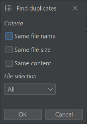
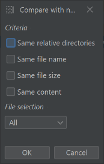
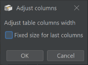
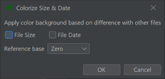

##  Clear Selection

Remove any selection

##  Select

Show a window to help you select file with similar names or extensions

##  Find duplicates

Try to find duplicated files in the current directory

##  Selection

Show in a pop-up menu a list of basic actions that can be performed on the selected files or directories

##  Shuffle rows

Shuffle the list of the files in the current location

##  Paste

Paste the file from the clipboard in the current location

##  Copy

Copy the files to the clipboard

##  Select All

Select all the visible files

##  Compare with next panel

Select files that are different between 2 directories. You need to have 2 table directory panels next to each other to use this feature.

##  Adjust columns

Adjust the width of the table columns to make the text the most visible

##  Print

Print the table (e.g. to a printer)

##  Invert Selection

Invert the selection. Selected files will become unselected and unselected file, selected.

##  Cut

Cut the file in the clipboard

##  Colorize Size and Dates

Will colorize the file date or size depending of the selected criteria

##  Select In Directory

Go to the directory of the selected file and select the file. This can be used when listing files from sub-directories

